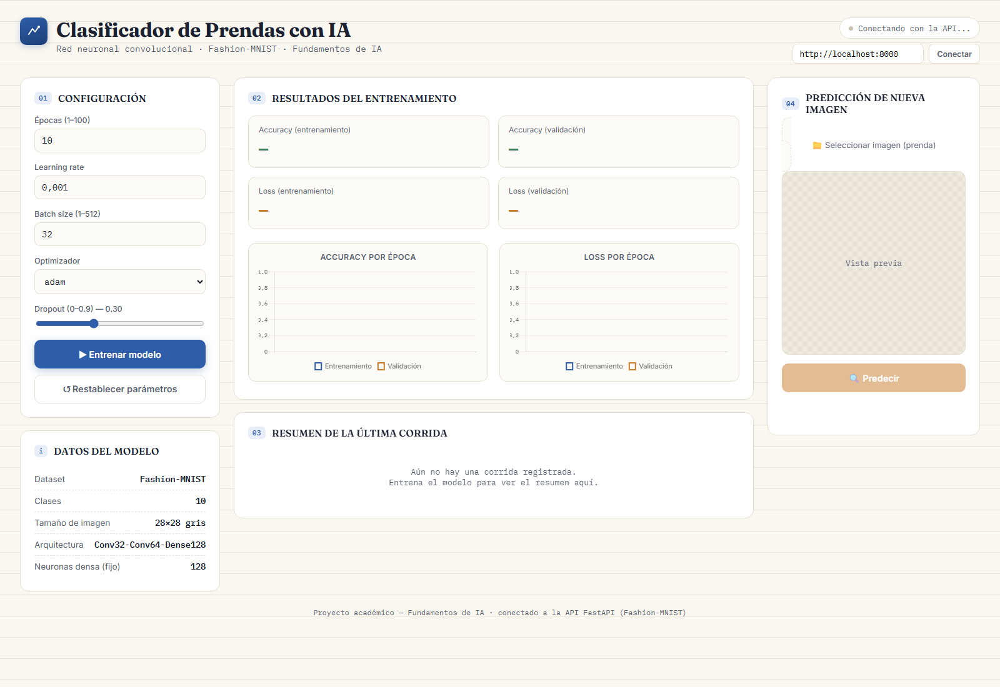

# Documentación del sistema

## 1. Descripción

El Clasificador de Prendas con IA es una aplicación web educativa que entrena una red neuronal convolucional con Fashion-MNIST y permite clasificar imágenes nuevas. La pantalla reúne configuración, resultados de entrenamiento y predicción en un solo espacio.

## 2. Usuarios

El sistema contempla un único rol local:

**Usuario u operador:** configura hiperparámetros, inicia el entrenamiento, consulta resultados, carga imágenes y solicita predicciones. No existe autenticación ni administración de cuentas.

## 3. Requisitos funcionales

| Código | Requisito |
|---|---|
| RF-01 | El sistema debe comprobar la conexión con la API. |
| RF-02 | Debe permitir consultar y actualizar la configuración. |
| RF-03 | Debe validar límites de épocas, batch size, learning rate y dropout. |
| RF-04 | Debe entrenar una CNN con Fashion-MNIST. |
| RF-05 | Debe guardar el modelo entrenado. |
| RF-06 | Debe guardar y consultar las métricas de la última corrida. |
| RF-07 | Debe representar accuracy y loss por época. |
| RF-08 | Debe aceptar la carga de una imagen. |
| RF-09 | Debe impedir la predicción si no existe un modelo. |
| RF-10 | Debe devolver clase, confianza y probabilidades. |

## 4. Requisitos no funcionales

| Código | Requisito |
|---|---|
| RNF-01 | La interfaz debe adaptarse a pantallas estrechas. |
| RNF-02 | Las entradas numéricas deben validarse en cliente y servidor. |
| RNF-03 | La API debe exponer documentación OpenAPI. |
| RNF-04 | Las rutas del proyecto deben ser independientes del equipo. |
| RNF-05 | El código debe separar presentación, API, modelo y persistencia. |
| RNF-06 | Los archivos JSON deben escribirse en UTF-8. |

## 5. Casos de uso

### CU-01: Comprobar conexión

- **Actor:** usuario.
- **Precondición:** la interfaz está abierta.
- **Flujo:** la interfaz solicita `/health` y `/status`; muestra el estado recibido.
- **Alternativa:** si la API no responde, muestra “No se pudo conectar con la API”.

### CU-02: Configurar y entrenar

- **Actor:** usuario.
- **Precondición:** API conectada y dependencias instaladas.
- **Flujo principal:**
  1. El usuario introduce los hiperparámetros.
  2. La interfaz envía `POST /config`.
  3. La interfaz solicita `POST /train`.
  4. El backend prepara los datos, entrena y guarda el modelo.
  5. La interfaz consulta `/metrics` y actualiza valores y gráficas.
- **Alternativas:** configuración inválida (422), error de descarga, falta de recursos o fallo del entrenamiento (500).

### CU-03: Consultar métricas

- **Actor:** usuario.
- **Precondición:** existe un historial.
- **Resultado:** se muestran accuracy, loss, configuración y fecha.
- **Alternativa:** si no hay historial, la API responde 404.

### CU-04: Clasificar imagen

- **Actor:** usuario.
- **Precondición:** existe `model.keras`.
- **Flujo principal:** selecciona la imagen, revisa la vista previa, pulsa predecir y recibe la clase y probabilidades.
- **Alternativas:** sin modelo (400), archivo ilegible o fallo de inferencia (500).

## 6. Pantallas y controles

### 6.1 Cabecera y conexión

La cabecera identifica el proyecto. El indicador cambia según la disponibilidad de la API y del modelo. El campo URL permite conectarse a otro host sin modificar código.

### 6.2 Panel de configuración

- **Épocas:** entre 1 y 100.
- **Learning rate:** valor positivo.
- **Batch size:** entre 1 y 512.
- **Optimizador:** Adam o SGD.
- **Dropout:** entre 0 y 0.9.
- **Entrenar modelo:** inicia la operación completa.
- **Restablecer parámetros:** recupera valores predeterminados en pantalla.

### 6.3 Resultados

Presenta accuracy y loss finales para entrenamiento y validación. Dos gráficas muestran su evolución por época. El resumen conserva configuración, fecha y, tras una corrida iniciada desde esa sesión, tiempo de entrenamiento.

### 6.4 Predicción

Permite seleccionar una imagen, observar su vista previa, ejecutar la predicción y consultar las cinco clases con mayor probabilidad.

## 7. Captura del sistema

**Figura 1.** Interfaz principal con los paneles de configuración, resultados y predicción. La evidencia se genera desde el código real de `frontend/`.

## 8. Reglas de negocio

- Una predicción solo se habilita cuando existen modelo e imagen seleccionada.
- Entrenar crea un modelo nuevo; no continúa el anterior.
- Cada entrenamiento sobrescribe el historial previo.
- Si el optimizador recibido no es exactamente `adam`, el backend utiliza SGD.
- La clase final corresponde al índice con mayor salida softmax.
- La confianza y probabilidades se expresan como porcentajes con dos decimales.

## 9. Datos

### Etiquetas

`backend/labels.json` relaciona índices de 0 a 9 con nombres en español. Su orden debe coincidir con Fashion-MNIST.

### Historial

`metrics/historial.json` contiene cuatro listas (`accuracy`, `val_accuracy`, `loss`, `val_loss`), la configuración y la fecha. Todas las listas deben tener una entrada por época.

### Modelo

`backend/model.keras` contiene el modelo serializado. No está incluido en control de versiones y debe generarse mediante entrenamiento.

## 10. Mensajes principales

| Situación | Comportamiento esperado |
|---|---|
| API disponible | “Conectado” y estado del modelo |
| API no disponible | “No se pudo conectar con la API” |
| Entrenamiento activo | Indicador y botón deshabilitado |
| Entrenamiento fallido | Caja de error con detalle |
| Sin modelo | Botón de predicción deshabilitado |
| Predicción correcta | Clase, confianza y barras de probabilidad |

## 11. Criterios de aceptación

- La interfaz abre sin errores estructurales.
- `/health` devuelve estado OK.
- La configuración válida se conserva durante la ejecución del servidor.
- El entrenamiento produce modelo e historial.
- Las métricas finales coinciden con el último elemento de cada lista.
- Una imagen válida produce diez probabilidades y una clase conocida.
- Reiniciar la API permite volver a cargar el modelo guardado.

